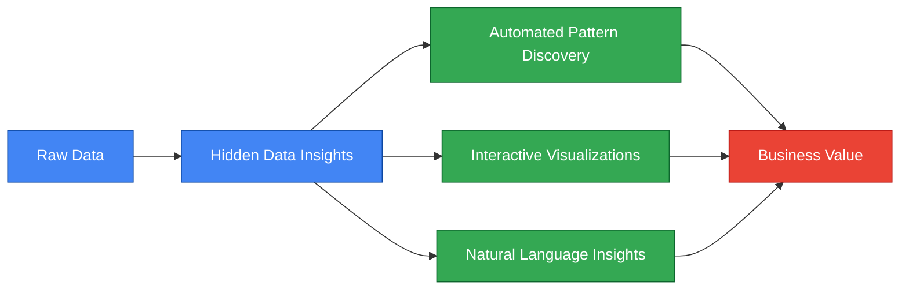
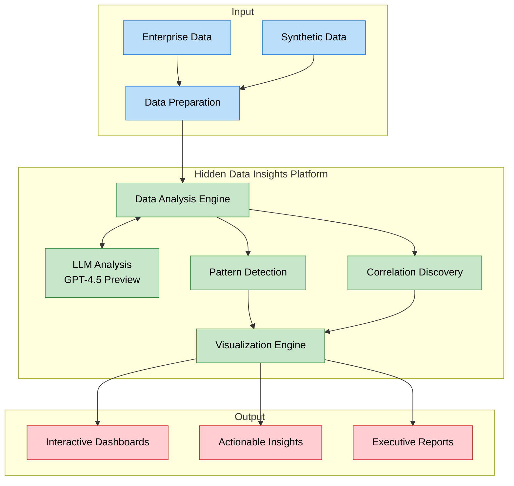

# Hidden Data Insights

A proof-of-concept application that demonstrates how Large Language Models (specifically OpenAI's GPT-4.5 Preview) can extract hidden patterns and insights from complex datasets without the need for specialized data analysts.

## Executive Summary

This solution enables organizations to extract valuable insights from their data without requiring specialized data science teams. By leveraging AI, it reduces time-to-insight from weeks to minutes.



### ROI Highlights
- **Cost Reduction**: 70-80% lower cost compared to traditional data analysis teams
- **Time Savings**: Insights in minutes instead of weeks
- **Accessibility**: Democratizes data insights across the organization
- **Scalability**: Analyze more data without proportional cost increases

## Overview

This application:
1. Generates synthetic datasets with embedded hidden patterns
2. Uses OpenAI's GPT-4.5 Preview model to analyze and extract insights from the data
3. Visualizes both the raw data and the discovered patterns
4. Provides a user-friendly web interface for interaction

## Use Cases

- **Business Intelligence**: Discover hidden trends in sales data
- **Market Analysis**: Identify unexpected correlations in customer behavior
- **Financial Forecasting**: Detect subtle patterns in financial time series
- **Product Optimization**: Uncover non-obvious relationships between product features and performance

## Solution Architecture



## Setup

1. Clone this repository
2. Set up a virtual environment:
   ```bash
   # Create a virtual environment
   python -m venv venv
   
   # Activate the virtual environment
   # On Windows:
   venv\Scripts\activate
   # On macOS/Linux:
   source venv/bin/activate
   ```
3. Install dependencies:
   ```bash
   pip install -r requirements.txt
   ```
4. Create a `.env` file in the root directory with your OpenAI API key and model:
   ```
   OPENAI_API_KEY=your_api_key_here
   OPENAI_MODEL=gpt-4.5-preview
   ```
5. Run the application:
   ```bash
   python src/app.py
   ```
6. Open your browser and navigate to `http://localhost:8050`

7. When you're done, deactivate the virtual environment:
   ```bash
   deactivate
   ```

## Running the Demo Script

To run the demo script without the web interface:

```bash
# Make sure your virtual environment is activated
python src/demo.py
```

The results will be displayed in the console and saved to `demo_results.txt`.

## Testing Different Models

You can easily test different OpenAI models without modifying your `.env` file using the included model tester script:

```bash
# List available models
python model_tester.py --list

# Run the demo with a specific model
python model_tester.py --model gpt-4 --demo

# Run the web app with a specific model
python model_tester.py --model gpt-3.5-turbo --app
```

This allows you to compare the performance of different models for your specific data analysis tasks.

## Troubleshooting

### OpenAI Package Compatibility Issues

If you encounter an error like `TypeError: Client.__init__() got an unexpected keyword argument 'proxies'`, it's due to compatibility issues with newer versions of the OpenAI package. The requirements.txt file specifies compatible versions, but if you still encounter issues:

```bash
# Uninstall current OpenAI package
pip uninstall -y openai

# Install specific versions
pip install openai==1.3.0 httpx==0.24.1
```

This ensures compatibility between the OpenAI client and its dependencies.

## Components

- **Data Generation**: Creates synthetic datasets with known hidden patterns
- **LLM Analysis**: Leverages OpenAI's GPT-4.5 Preview to extract insights
- **Visualization**: Interactive dashboards to explore data and findings
- **Web Interface**: User-friendly interface for uploading custom datasets and viewing results

## Benefits

- **Cost Reduction**: Minimize the need for specialized data analysts
- **Efficiency**: Quickly identify patterns that might take humans days or weeks to discover
- **Accessibility**: Make data insights available to non-technical stakeholders
- **Scalability**: Process and analyze large datasets with minimal human intervention