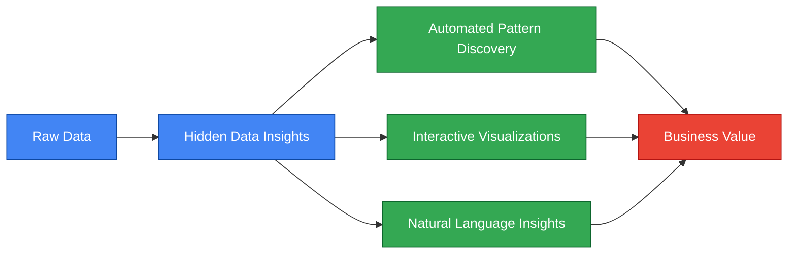
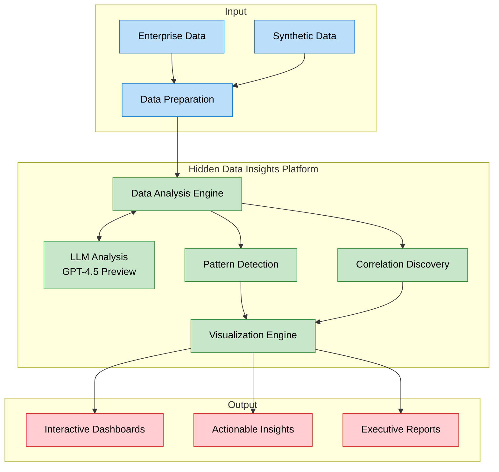

# Background

A proof-of-concept application that demonstrates how Large Language Models (specifically OpenAI's GPT-4.5 Preview) can extract hidden patterns and insights from complex datasets without the need for specialized data analysts.

## Business Problem

Organizations face the challenge of extracting timely and actionable insights from vast and complex datasets, often requiring significant time, cost, and specialized expertise.

## Executive Summary

This solution enables organizations to extract valuable insights from their data without requiring specialized data science teams. By leveraging AI, it reduces time-to-insight from weeks to minutes.



## Motivation

This approach addresses several major pain points and motivations that organizations face with traditional data analysis methods:

1. **Time-Consuming Processes**:
   - **Motivation**: Traditional data analysis can be slow, often taking weeks to deliver actionable insights.
   - **Alleviation**: This solution significantly reduces the time-to-insight, providing results in minutes, which is crucial for timely decision-making.

2. **High Costs**:
   - **Motivation**: Employing specialized data analysts and maintaining large data teams can be expensive.
   - **Alleviation**: By automating complex analysis tasks, the solution reduces the need for extensive human resources, leading to substantial cost savings.

3. **Limited Accessibility**:
   - **Motivation**: Data insights are often confined to technical teams, limiting their accessibility to non-technical stakeholders.
   - **Alleviation**: The solution democratizes data insights, making them accessible to a broader audience through a user-friendly interface and natural language processing.

4. **Scalability Challenges**:
   - **Motivation**: As data volumes grow, traditional methods struggle to scale efficiently without incurring proportional cost increases.
   - **Alleviation**: The solution is designed to handle large datasets and scale without significant additional costs, ensuring efficiency as data needs grow.

5. **Complexity in Pattern Discovery**:
   - **Motivation**: Identifying hidden patterns and correlations in data can be challenging and often requires advanced expertise.
   - **Alleviation**: The solution leverages AI to automatically discover patterns and insights that might be missed by human analysts, enhancing the depth of analysis.

6. **Integration and Flexibility**:
   - **Motivation**: Integrating new data analysis tools with existing systems can be complex and disruptive.
   - **Alleviation**: The solution is designed for seamless integration with existing enterprise systems, minimizing disruption and ensuring flexibility.

7. **Keeping Up with Technological Advances**:
   - **Motivation**: Staying current with the latest advancements in AI and data analysis can be challenging.
   - **Alleviation**: The solution is built to incorporate the latest AI models and techniques, ensuring that organizations remain at the cutting edge of technology.

## Overview

This application:
1. Generates synthetic datasets with embedded hidden patterns
2. Uses OpenAI's GPT-4.5 Preview model to analyze and extract insights from the data
3. Visualizes both the raw data and the discovered patterns
4. Provides a user-friendly web interface for interaction

## Use Cases

- **Business Intelligence**: Discover hidden trends in sales data
- **Market Analysis**: Identify unexpected correlations in customer behavior
- **Financial Forecasting**: Detect subtle patterns in financial time series
- **Product Optimization**: Uncover non-obvious relationships between product features and performance

## Solution Architecture



## Setup

1. Clone this repository
2. Set up a virtual environment:
   ```bash
   # Create a virtual environment
   python -m venv venv
   
   # Activate the virtual environment
   # On Windows:
   venv\Scripts\activate
   # On macOS/Linux:
   source venv/bin/activate
   ```
3. Install dependencies:
   ```bash
   pip install -r requirements.txt
   ```
4. Create a `.env` file in the root directory with your OpenAI API key and model:
   ```
   OPENAI_API_KEY=your_api_key_here
   OPENAI_MODEL=gpt-4.5-preview
   ```
5. Run the application:
   ```bash
   python src/app.py
   ```
6. Open your browser and navigate to `http://localhost:8050`

7. When you're done, deactivate the virtual environment:
   ```bash
   deactivate
   ```

## Running the Demo Script

To run the demo script without the web interface:

```bash
# Make sure your virtual environment is activated
python src/demo.py
```

The results will be displayed in the console and saved to `demo_results.txt`.

## Testing Different Models

You can easily test different OpenAI models without modifying your `.env` file using the included model tester script:

```bash
# List available models
python model_tester.py --list

# Run the demo with a specific model
python model_tester.py --model gpt-4 --demo

# Run the web app with a specific model
python model_tester.py --model gpt-3.5-turbo --app
```

This allows you to compare the performance of different models for your specific data analysis tasks.

## Troubleshooting

### OpenAI Package Compatibility Issues

If you encounter an error like `TypeError: Client.__init__() got an unexpected keyword argument 'proxies'`, it's due to compatibility issues with newer versions of the OpenAI package. The requirements.txt file specifies compatible versions, but if you still encounter issues:

```bash
# Uninstall current OpenAI package
pip uninstall -y openai

# Install specific versions
pip install openai==1.3.0 httpx==0.24.1
```

This ensures compatibility between the OpenAI client and its dependencies.

## Components

- **Data Generation**: Creates synthetic datasets with known hidden patterns
- **LLM Analysis**: Leverages OpenAI's GPT-4.5 Preview to extract insights
- **Visualization**: Interactive dashboards to explore data and findings
- **Web Interface**: User-friendly interface for uploading custom datasets and viewing results

## Benefits

Adopting this approach over traditional data analysis methods offers several compelling advantages:

1. **Speed and Efficiency**:
   - **Rapid Insights**: The solution can deliver insights in minutes rather than weeks, significantly reducing the time-to-insight.
   - **Automated Analysis**: By leveraging AI, the solution automates complex data analysis tasks, freeing up human resources for more strategic activities.

2. **Cost-Effectiveness**:
   - **Reduced Labor Costs**: It minimizes the need for large teams of specialized data analysts, leading to substantial cost savings.
   - **Scalable Solutions**: The solution can handle increasing data volumes without proportional cost increases, unlike traditional methods that often require more personnel and resources.

3. **Accessibility and Democratization**:
   - **User-Friendly Interface**: The web interface allows non-technical stakeholders to interact with data and gain insights without needing deep technical expertise.
   - **Natural Language Insights**: The use of LLMs enables users to query data and receive insights in natural language, making data analysis more accessible to a broader audience.

4. **Advanced Capabilities**:
   - **Pattern Discovery**: The solution can uncover hidden patterns and correlations that might be missed by human analysts, providing deeper insights.
   - **Real-Time Analysis**: It supports real-time data analysis, which is crucial for dynamic business environments where timely decisions are essential.

5. **Flexibility and Adaptability**:
   - **Model Testing**: The ability to test different OpenAI models allows organizations to tailor the solution to their specific needs and optimize performance.
   - **Integration with Existing Systems**: The solution is designed to integrate with existing enterprise data systems, ensuring a smooth transition and minimal disruption.

6. **Future-Proofing**:
   - **Continuous Improvement**: The solution can easily incorporate the latest advancements in AI and machine learning, keeping the organization at the forefront of technology.
   - **Adaptability to New Data Sources**: It can quickly adapt to new data sources and types, ensuring long-term relevance and utility.

## Production Challenges

- **Data Privacy & Security**: 
  - Handling sensitive business data with external LLM providers
  - Ensuring compliance with data protection regulations (GDPR, CCPA, etc.)
  - Managing data residency requirements across different jurisdictions

- **Cost Management**:
  - Optimizing API calls to LLMs to control operational costs
  - Balancing analysis depth with token usage
  - Managing concurrent user requests efficiently

- **Model Reliability**:
  - Handling API downtime and service interruptions
  - Ensuring consistent quality of insights across different data types
  - Validating AI-generated insights against ground truth

- **Integration Complexity**:
  - Connecting with existing enterprise data systems
  - Managing data format compatibility
  - Implementing robust error handling and fallback mechanisms

- **Performance at Scale**:
  - Handling large-scale concurrent analysis requests
  - Managing memory usage with large datasets
  - Optimizing response times for real-time insights

- **Maintenance & Updates**:
  - Keeping up with LLM model updates and API changes
  - Managing system dependencies and security patches
  - Monitoring and improving system performance

## Mitigation Strategies

### Data Privacy & Security
- Implement data anonymization and encryption pipelines before LLM processing
- Use private LLM deployments or on-premises solutions for sensitive data
- Regular security audits and compliance checks
- Implement role-based access control (RBAC) for data access
- Maintain detailed audit logs of all data processing activities

### Cost Management
- Implement intelligent caching for common queries and results
- Use tiered analysis approach: basic analysis first, deeper analysis on demand
- Batch processing for non-time-critical analyses
- Monitor and optimize token usage with automated alerts
- Implement usage quotas and budgeting controls

### Model Reliability
- Deploy multiple LLM providers for failover redundancy
- Implement robust retry mechanisms with exponential backoff
- Create automated validation pipelines for insight verification
- Maintain fallback to traditional analysis methods
- Regular model performance benchmarking and monitoring

### Integration Complexity
- Build standardized data adapters for common enterprise systems
- Implement comprehensive input validation and sanitization
- Use message queues for reliable system communication
- Maintain detailed API documentation and integration guides
- Create automated testing suites for integration points

### Performance at Scale
- Implement horizontal scaling with load balancing
- Use distributed caching systems (e.g., Redis)
- Optimize database queries and indexing
- Implement request prioritization and queue management
- Regular performance testing and optimization cycles

### Maintenance & Updates
- Automated dependency vulnerability scanning
- Continuous Integration/Continuous Deployment (CI/CD) pipelines
- Feature flags for gradual rollout of updates
- Comprehensive system monitoring and alerting
- Regular backup and disaster recovery testing

### Myths vs. Reality

1. **AI Replaces Human Analysts**:
   - **Misconception**: Some believe that AI will completely replace human data analysts, leading to job losses.
   - **Reality**: AI is designed to augment human capabilities, handling repetitive tasks and allowing analysts to focus on more strategic, value-added activities.

2. **High Initial Costs**:
   - **Misconception**: Organizations may assume that implementing AI-driven solutions requires significant upfront investment.
   - **Reality**: While there may be initial setup costs, the long-term savings in labor and time often outweigh these, making it a cost-effective solution.

3. **Complexity and Integration Issues**:
   - **Misconception**: There is a belief that integrating AI solutions with existing systems is overly complex and disruptive.
   - **Reality**: Modern AI solutions are designed for seamless integration and can be tailored to fit within existing IT infrastructures with minimal disruption.

4. **Data Privacy Concerns**:
   - **Misconception**: Organizations worry that using AI, especially cloud-based solutions, compromises data privacy and security.
   - **Reality**: With proper data anonymization, encryption, and compliance measures, AI solutions can be implemented securely, protecting sensitive information.

5. **AI is a Black Box**:
   - **Misconception**: Some view AI as a "black box" that provides insights without transparency, making it difficult to trust.
   - **Reality**: Many AI solutions now offer explainability features, allowing users to understand how insights are derived and increasing trust in the results.

6. **Only for Large Enterprises**:
   - **Misconception**: There is a perception that AI-driven data analysis is only suitable for large organizations with vast resources.
   - **Reality**: AI solutions are scalable and can be adapted to fit the needs and budgets of small to medium-sized enterprises as well. 
